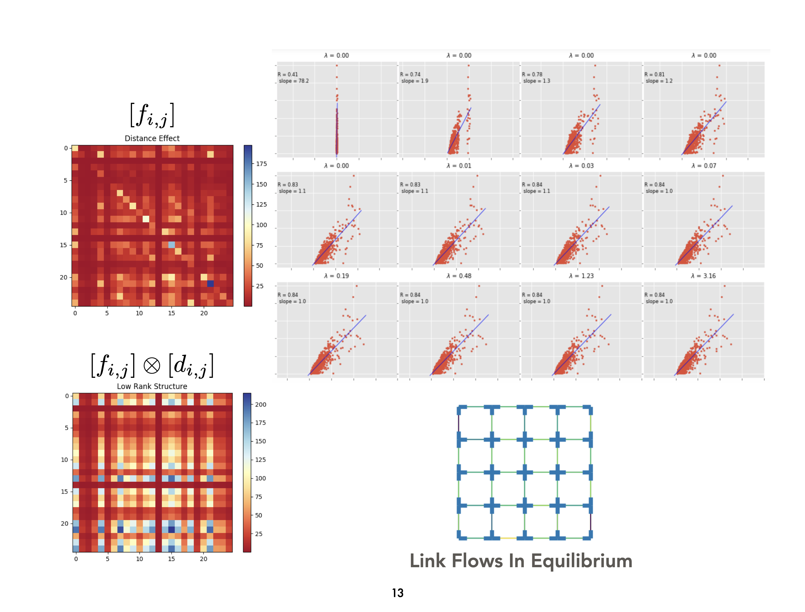

# OD-MatrixEstimation
This is a repository containing my undergrad thesis project regarding origin destination matrices estimation using convex optimization and sparse reconstruction techniques. There is a brief presentation available [here](Slides%202.pdf).
File 'Test.ipynb' contains a synthetis simulation.  

## Introduction
There is an annual questionairre where every household should fill out which entails questions regarding the places that you frequently visit and currently reside in. This information is then used for urban planning by estimating the demand between distinct regions of the city. For instance, around 6-7AM people will commute from their houses to their work places (demand) and the goal is to build an expectation of the traffic as a consequence of this demand.  The goal of this project is to elevate this mannual process into a more robust data oriented way. The data that we intend to implemet our algorihtm on is a traffic index data scraped from google maps on a street level. 

**Challenges**:
* Google maps only provides a binned/discretized traffic data over various segments of the graph. Therefore, a significant amount of information is lost through this discretization which makes our estimation problem more difficult.
* Traffic is an indirect aggregate consequnce of origin-destination demand matrix. In other words, for a given origin-destination matrix we can recover the traffic intensity of our graph; however, we are dealing with an inverse problem of estimating the demand matrix through observing traffic. Indeed, identifiability may be hopeless for such inverse problems without any structural assumptions. To resolve this issue, we impose some usual compressed sensing assumptions on the demand matrix so that the problem would not be ill-posed.

The algorithm introduced below is tested on a synthetic dataset. 

## Method
We generated a rank one origin destination demand matrix and then affect the matrix with a distance matrix. We 
use the gravity model where every region has two masses, one for retraction and one for attraction, and 
assume the demand matrix satisfy the newtonian gravity law framework-- two regions are attracted to each other based on multiplication of their associated masses and inversely proportional to some measure of distance betweem them. Subsequently, we solve the 
[user equilibrium](https://en.wikipedia.org/wiki/John_Glen_Wardrop) via a projection free method.

